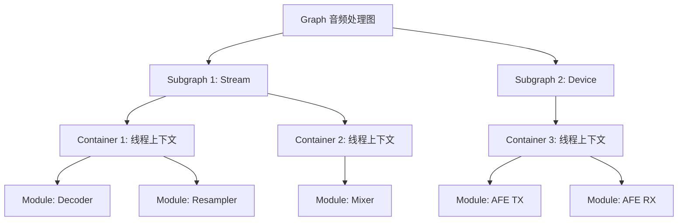
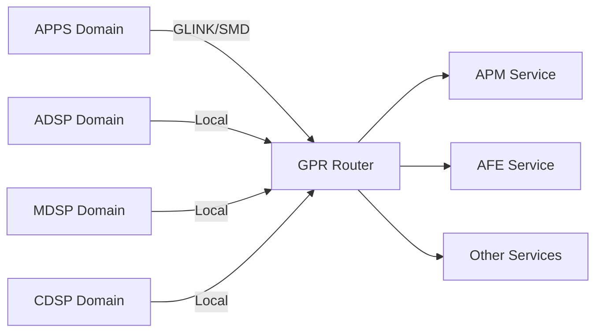
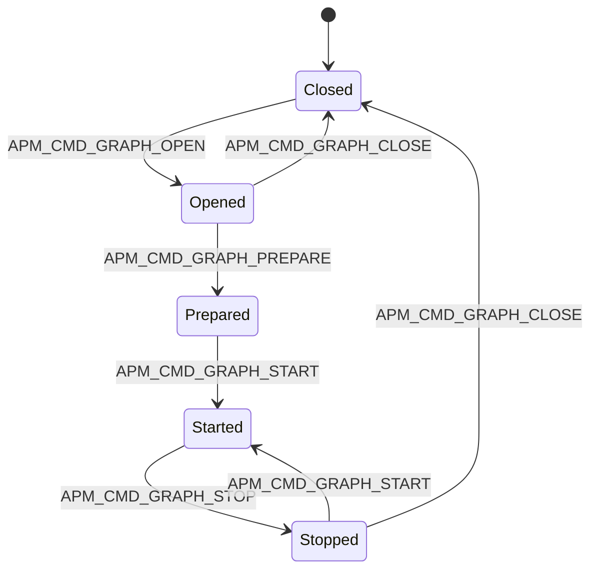
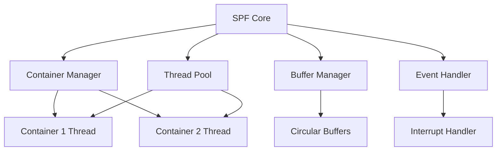
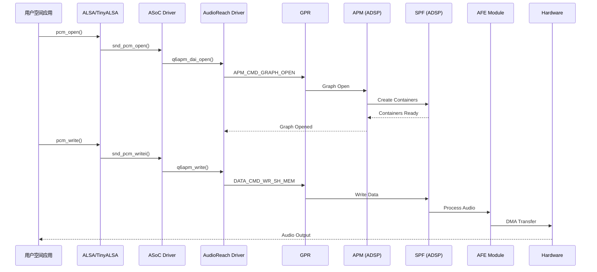
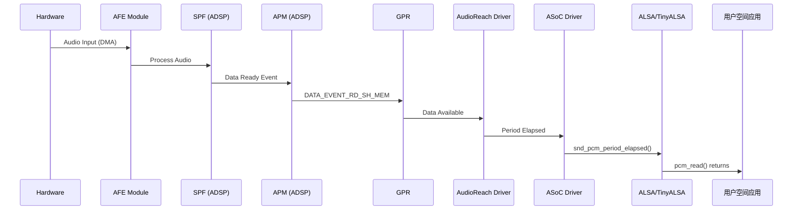

# AudioReach 架构详解

## 概述

AudioReach 是 Qualcomm 开源的音频处理框架，运行在 ADSP (Audio DSP) 或 CDSP (Compute DSP) 上。它取代了传统的 QDSP6 架构（q6asm/q6adm/q6afe），提供了更灵活、模块化的音频处理能力。AudioReach 通过动态构建音频处理图（Graph）来实现各种音频场景，支持低延迟、低功耗的音频处理。

**重要提示：** 本文档基于 Linux 内核上游源码（6.8+）分析。USB Audio Offload 的真实实现路径与传统 AFE 数据路径不同，详见"上游源码限制"章节。

## 核心概念层次结构

AudioReach 采用四层架构，从上到下依次为：Graph → Subgraph → Container → Module。



### Graph（图）

Graph 是 AudioReach 中的顶层概念，代表一个完整的音频处理流程。每个 Graph 由 APM (Audio Processing Manager) 管理，包含一个或多个 Subgraph。

**特点：**
- 每个音频会话（playback, capture, voice call 等）对应一个 Graph
- Graph 的生命周期：Open → Start → Stop → Close
- 支持动态重配置（无需关闭 Graph）

**示例：播放场景的 Graph**
```
Playback Graph
├── Stream Subgraph (解码、重采样)
└── Device Subgraph (设备输出)
```

### Subgraph（子图）

Subgraph 是 Graph 的功能分组，通常按照数据流的逻辑阶段划分。

**常见类型：**
1. **Stream Subgraph**：处理音频流数据
   - 包含 decoder, encoder, resampler, volume control 等
   - 与具体硬件设备无关
   
2. **Device Subgraph**：处理设备相关操作
   - 包含 AFE (Audio Front End) 模块
   - 与具体硬件设备绑定（Speaker, Headphone, USB, BT 等）

**Subgraph 连接：**
```c
// Subgraph 间通过 data link 连接
struct apm_sub_graph_data {
    uint32_t sub_graph_id;
    uint32_t num_sub_graphs;
    uint32_t sub_graph_cfg_data_size;
    // ...
};
```

### Container（容器）

Container 是执行上下文，每个 Container 对应一个独立的线程，具有独立的优先级和栈大小。

**关键属性：**
- **Thread Priority**：实时优先级（0-255）
- **Stack Size**：线程栈大小
- **Heap ID**：内存分配的堆 ID
- **Frame Duration**：处理帧的时长（影响延迟）

**Container 配置示例：**
```c
struct apm_container_cfg {
    uint32_t container_id;
    uint32_t num_prop;
    struct apm_prop_data prop_data[];
};

struct apm_cont_prop_id_stack_size {
    uint32_t stack_size;  // 例如：8192 字节
};

struct apm_cont_prop_id_thread_priority {
    uint32_t priority;    // 例如：128（实时优先级）
};
```

**Container 类型：**
- **Single-threaded Container**：单线程处理多个模块
- **Multi-threaded Container**：每个模块独立线程（罕见）

### Module（模块）

Module 是最小的音频处理单元，执行具体的音频算法。

**常见模块类型：**

| 模块类型 | Module ID | 功能描述 |
|---------|-----------|---------|
| PCM Decoder | 0x07001005 | 解码 PCM 数据 |
| PCM Encoder | 0x07001006 | 编码 PCM 数据 |
| AAC Decoder | 0x0700101F | 解码 AAC 音频 |
| MP3 Decoder | 0x0700101B | 解码 MP3 音频 |
| Resampler | 0x07001016 | 采样率转换 |
| Volume Control | 0x07001002 | 音量控制 |
| Mixer | 0x07001015 | 多路音频混音 |
| AFE Port | 0x07001000 | 音频前端接口 |
| Splitter | 0x07001011 | 音频流分离 |

**Module 配置：**
```c
struct apm_module_param_data {
    uint32_t module_instance_id;
    uint32_t param_id;
    uint32_t param_size;
    uint8_t  param_data[];
};

// 示例：配置 Resampler 模块
struct param_id_pcm_output_format_cfg {
    uint32_t data_format;       // PCM
    uint32_t fmt_id;            // MEDIA_FMT_ID_PCM
    uint32_t sample_rate;       // 48000 Hz
    uint16_t bit_width;         // 16 bit
    uint16_t num_channels;      // 2 (Stereo)
    uint16_t channel_mapping[]; // [L, R]
};
```

## GPR (Generic Packet Router) 通信机制

GPR 是 AudioReach 的核心通信协议，用于 APPS 处理器与 DSP 之间的 IPC (Inter-Process Communication)。

### GPR 架构



### GPR Packet 结构

```c
struct gpr_packet {
    struct gpr_hdr hdr;
    uint8_t payload[];
};

struct gpr_hdr {
    uint32_t version:4;
    uint32_t hdr_size:4;
    uint32_t pkt_size:24;
    uint32_t src_domain:8;
    uint32_t dst_domain:8;
    uint32_t reserved:16;
    uint32_t src_port;
    uint32_t dst_port;
    uint32_t token;
    uint32_t opcode;
};
```

**关键字段：**
- **src_domain / dst_domain**：源/目标域（APPS=1, ADSP=3, MDSP=4, CDSP=5）
- **src_port / dst_port**：源/目标端口（服务标识）
- **token**：请求/响应匹配令牌
- **opcode**：操作码（命令类型）

### GPR 传输层

GPR 通过 GLINK (Generic Link) 或 SMD (Shared Memory Driver) 进行物理传输：

```c
// GLINK 通道初始化
struct glink_link_info {
    char *transport;  // "smem"
    char *edge;       // "lpass"
    char *name;       // "apr_audio_svc"
};

// 发送 GPR packet
int gpr_send_pkt(struct gpr_device *gdev, struct gpr_packet *pkt) {
    return glink_tx(gdev->channel, pkt, pkt->hdr.pkt_size, 
                    GLINK_TX_REQ_INTENT);
}
```

### 常见 GPR Opcode

| Opcode | 值 | 描述 |
|--------|---|------|
| APM_CMD_GRAPH_OPEN | 0x01001000 | 打开 Graph |
| APM_CMD_GRAPH_PREPARE | 0x01001001 | 准备 Graph |
| APM_CMD_GRAPH_START | 0x01001002 | 启动 Graph |
| APM_CMD_GRAPH_STOP | 0x01001003 | 停止 Graph |
| APM_CMD_GRAPH_CLOSE | 0x01001004 | 关闭 Graph |
| APM_CMD_SET_CFG | 0x01001005 | 设置配置 |
| APM_CMD_GET_CFG | 0x01001006 | 获取配置 |
| DATA_CMD_WR_SH_MEM_EP_DATA_BUFFER | 0x04001001 | 写共享内存数据 |
| DATA_CMD_RD_SH_MEM_EP_DATA_BUFFER | 0x04001002 | 读共享内存数据 |

## APM (Audio Processing Manager)

APM 是 AudioReach 的核心管理服务，运行在 DSP 上，负责 Graph 的生命周期管理。

### APM 职责

1. **Graph 管理**
   - 创建、配置、启动、停止、销毁 Graph
   - 管理 Subgraph 和 Container 的关联
   
2. **Module 连接**
   - 建立 Module 之间的数据连接
   - 配置数据格式和缓冲区大小
   
3. **配置管理**
   - 处理 set_config/get_config 命令
   - 动态更新 Module 参数
   
4. **事件通知**
   - 向 APPS 发送事件（EOS, 错误等）

### Graph 生命周期



### Graph Open 流程

```c
// 1. 构建 Graph Open 命令
struct apm_cmd_graph_open {
    struct apm_cmd_header hdr;
    uint32_t graph_id;
    uint32_t num_sub_graphs;
    struct apm_sub_graph_cfg sub_graphs[];
};

// 2. 发送 GPR packet
struct gpr_packet *pkt = alloc_gpr_pkt(APM_CMD_GRAPH_OPEN, size);
pkt->hdr.src_domain = GPR_DOMAIN_ID_APPS;
pkt->hdr.dst_domain = GPR_DOMAIN_ID_ADSP;
pkt->hdr.dst_port = APM_MODULE_INSTANCE_ID;
memcpy(pkt->payload, &graph_open_cmd, size);
gpr_send_pkt(gdev, pkt);

// 3. 等待响应
wait_for_completion_timeout(&graph->cmd_done, timeout);
```

### Module 连接配置

```c
struct apm_module_conn_cfg {
    uint32_t num_connections;
    struct apm_module_conn connections[];
};

struct apm_module_conn {
    uint32_t src_mod_inst_id;   // 源模块实例 ID
    uint32_t src_mod_op_port_id; // 源模块输出端口
    uint32_t dst_mod_inst_id;   // 目标模块实例 ID
    uint32_t dst_mod_ip_port_id; // 目标模块输入端口
};

// 示例：连接 Decoder -> Resampler -> Mixer
connections[0] = {
    .src_mod_inst_id = DECODER_MODULE_ID,
    .src_mod_op_port_id = 1,
    .dst_mod_inst_id = RESAMPLER_MODULE_ID,
    .dst_mod_ip_port_id = 2,
};
connections[1] = {
    .src_mod_inst_id = RESAMPLER_MODULE_ID,
    .src_mod_op_port_id = 1,
    .dst_mod_inst_id = MIXER_MODULE_ID,
    .dst_mod_ip_port_id = 2,
};
```

## SPF (Signal Processing Framework)

SPF 是 AudioReach 的运行时框架，运行在 DSP 上，负责实际的音频处理调度。

### SPF 架构



### Container 调度

每个 Container 运行在独立的线程中，SPF 负责调度：

```c
// Container 线程主循环（伪代码）
void container_thread_loop(container_t *cont) {
    while (!cont->exit_flag) {
        // 1. 等待数据或命令
        wait_for_signal(cont->signal);
        
        // 2. 处理命令队列
        process_command_queue(cont);
        
        // 3. 处理数据流
        for (module in cont->modules) {
            if (module_has_input_data(module)) {
                module_process(module);
            }
        }
        
        // 4. 更新缓冲区状态
        update_buffer_status(cont);
    }
}
```

### 数据缓冲区管理

SPF 使用循环缓冲区（Circular Buffer）在 Module 之间传递数据：

```c
struct spf_circ_buf {
    uint8_t *base_addr;
    uint32_t size;
    uint32_t read_offset;
    uint32_t write_offset;
    uint32_t unread_bytes;
};

// 写入数据
int spf_circ_buf_write(struct spf_circ_buf *buf, uint8_t *data, uint32_t len) {
    if (buf->size - buf->unread_bytes < len)
        return -ENOMEM;
    
    uint32_t write_pos = buf->write_offset;
    uint32_t chunk1 = min(len, buf->size - write_pos);
    memcpy(buf->base_addr + write_pos, data, chunk1);
    
    if (len > chunk1) {
        memcpy(buf->base_addr, data + chunk1, len - chunk1);
    }
    
    buf->write_offset = (write_pos + len) % buf->size;
    buf->unread_bytes += len;
    return 0;
}
```

### 事件和中断处理

SPF 处理来自硬件和软件的事件：

```c
// 事件类型
enum spf_event_type {
    SPF_EVENT_DATA_AVAILABLE,    // 数据可用
    SPF_EVENT_BUFFER_FULL,       // 缓冲区满
    SPF_EVENT_BUFFER_EMPTY,      // 缓冲区空
    SPF_EVENT_EOS,               // 流结束
    SPF_EVENT_ERROR,             // 错误
};

// 事件处理器
void spf_event_handler(struct spf_event *event) {
    switch (event->type) {
    case SPF_EVENT_DATA_AVAILABLE:
        signal_container(event->container_id);
        break;
    case SPF_EVENT_EOS:
        notify_apm_eos(event->graph_id);
        break;
    // ...
    }
}
```

## 完整数据流路径

### 播放路径（Playback）



### 录音路径（Capture）



## 控制流路径


### 示例：设置音量

```c
// 1. 用户空间
snd_ctl_elem_value_set_integer(ctl, 0, volume);
snd_ctl_elem_write(card, ctl);

// 2. 内核空间 - ASoC
static int q6apm_dai_set_volume(struct snd_kcontrol *kcontrol,
                                struct snd_ctl_elem_value *ucontrol)
{
    int volume = ucontrol->value.integer.value[0];
    return audioreach_set_module_param(graph, MODULE_ID_VOLUME_CONTROL,
                                       PARAM_ID_VOLUME, &volume, sizeof(volume));
}

// 3. AudioReach Driver
int audioreach_set_module_param(struct q6apm_graph *graph, uint32_t module_id,
                                uint32_t param_id, void *data, uint32_t size)
{
    struct apm_module_param_data *param;
    struct gpr_packet *pkt;
    
    pkt = alloc_gpr_pkt(APM_CMD_SET_CFG, sizeof(*param) + size);
    param = (void *)pkt->payload;
    param->module_instance_id = module_id;
    param->param_id = param_id;
    param->param_size = size;
    memcpy(param->param_data, data, size);
    
    return gpr_send_pkt_sync(graph->gdev, pkt);
}
```

## 与传统 QDSP6 的对比

| 特性 | 传统 QDSP6 (q6asm/q6adm/q6afe) | AudioReach |
|------|-------------------------------|------------|
| 架构 | 固定的三层架构（ASM/ADM/AFE） | 灵活的 Graph 架构 |
| 音频路径 | 预定义的路径 | 动态构建的 Graph |
| 模块化 | 有限的模块支持 | 完全模块化，易于扩展 |
| 配置灵活性 | 配置选项有限 | 高度可配置 |
| 开源程度 | 闭源 | 部分开源（内核驱动开源） |
| 性能 | 优化良好 | 更灵活，性能相当 |
| 延迟 | 低延迟 | 可配置延迟（通过 Container） |
| 多流支持 | 有限 | 原生支持多流混音 |
| 动态重配置 | 需要重启会话 | 支持动态重配置 |

### 传统 QDSP6 架构

```
用户空间
    ↓
q6asm (Audio Stream Manager)
    ↓
q6adm (Audio Device Manager)
    ↓
q6afe (Audio Front End)
    ↓
Hardware
```

### AudioReach 架构

```
用户空间
    ↓
AudioReach Driver
    ↓
GPR (Generic Packet Router)
    ↓
APM (Audio Processing Manager)
    ↓
SPF (Signal Processing Framework)
    ↓
Graph (Subgraph → Container → Module)
    ↓
Hardware
```

## 实际应用示例

### 示例 1：简单播放场景

```c
// Graph 配置
struct playback_graph {
    // Subgraph 1: Stream Processing
    struct subgraph stream_sg = {
        .id = 1,
        .containers = {
            {
                .id = 1,
                .modules = {
                    {.id = MODULE_PCM_DECODER, .iid = 0x1001},
                    {.id = MODULE_VOLUME_CTRL, .iid = 0x1002},
                },
            },
        },
    };
    
    // Subgraph 2: Device Output
    struct subgraph device_sg = {
        .id = 2,
        .containers = {
            {
                .id = 2,
                .modules = {
                    {.id = MODULE_AFE_PORT_RX, .iid = 0x2001},
                },
            },
        },
    };
    
    // Connections
    struct connections = {
        {0x1001, 1, 0x1002, 2},  // Decoder -> Volume
        {0x1002, 1, 0x2001, 2},  // Volume -> AFE
    };
};
```

### 示例 2：带重采样的播放

```c
struct playback_with_resample_graph {
    struct subgraph stream_sg = {
        .id = 1,
        .containers = {
            {
                .id = 1,
                .modules = {
                    {.id = MODULE_PCM_DECODER, .iid = 0x1001},
                    {.id = MODULE_RESAMPLER, .iid = 0x1002},
                    {.id = MODULE_VOLUME_CTRL, .iid = 0x1003},
                },
            },
        },
    };
    
    struct subgraph device_sg = {
        .id = 2,
        .containers = {
            {
                .id = 2,
                .modules = {
                    {.id = MODULE_AFE_PORT_RX, .iid = 0x2001},
                },
            },
        },
    };
    
    struct connections = {
        {0x1001, 1, 0x1002, 2},  // Decoder -> Resampler
        {0x1002, 1, 0x1003, 2},  // Resampler -> Volume
        {0x1003, 1, 0x2001, 2},  // Volume -> AFE
    };
};

// 配置 Resampler
struct param_id_pcm_output_format_cfg resample_cfg = {
    .sample_rate = 48000,  // 输出 48kHz
    .bit_width = 16,
    .num_channels = 2,
};
audioreach_set_module_param(graph, 0x1002, 
                            PARAM_ID_PCM_OUTPUT_FORMAT,
                            &resample_cfg, sizeof(resample_cfg));
```

### 示例 3：多路混音

```c
struct multi_stream_mixer_graph {
    // Stream 1
    struct subgraph stream1_sg = {
        .id = 1,
        .containers = {{.id = 1, .modules = {{.id = MODULE_PCM_DECODER, .iid = 0x1001}}}},
    };
    
    // Stream 2
    struct subgraph stream2_sg = {
        .id = 2,
        .containers = {{.id = 2, .modules = {{.id = MODULE_PCM_DECODER, .iid = 0x2001}}}},
    };
    
    // Mixer
    struct subgraph mixer_sg = {
        .id = 3,
        .containers = {
            {
                .id = 3,
                .modules = {
                    {.id = MODULE_MIXER, .iid = 0x3001},
                    {.id = MODULE_VOLUME_CTRL, .iid = 0x3002},
                },
            },
        },
    };
    
    // Device
    struct subgraph device_sg = {
        .id = 4,
        .containers = {{.id = 4, .modules = {{.id = MODULE_AFE_PORT_RX, .iid = 0x4001}}}},
    };
    
    struct connections = {
        {0x1001, 1, 0x3001, 2},  // Stream1 -> Mixer
        {0x2001, 1, 0x3001, 3},  // Stream2 -> Mixer
        {0x3001, 1, 0x3002, 2},  // Mixer -> Volume
        {0x3002, 1, 0x4001, 2},  // Volume -> AFE
    };
};
```

## 调试和诊断

### 内核日志

```bash
# 启用 AudioReach 调试日志
echo 8 > /proc/sys/kernel/printk
echo 'module q6apm +p' > /sys/kernel/debug/dynamic_debug/control
echo 'module q6apm_dai +p' > /sys/kernel/debug/dynamic_debug/control
echo 'module audioreach +p' > /sys/kernel/debug/dynamic_debug/control

# 查看日志
dmesg | grep -E 'q6apm|audioreach|gpr'
```

### GPR Packet 追踪

```c
// 在 gpr_send_pkt() 中添加日志
pr_debug("GPR TX: opcode=0x%x src=%d:%d dst=%d:%d token=0x%x size=%d\n",
         pkt->hdr.opcode,
         pkt->hdr.src_domain, pkt->hdr.src_port,
         pkt->hdr.dst_domain, pkt->hdr.dst_port,
         pkt->hdr.token, pkt->hdr.pkt_size);
```

### Graph 状态查询

```bash
# 查看当前活动的 Graph
cat /sys/kernel/debug/audioreach/graphs

# 查看 Module 状态
cat /sys/kernel/debug/audioreach/modules
```

## 上游源码限制

### USB Audio Offload 的真实路径

通过分析上游内核源码（Linux 6.8+），USB Audio Offload 的真实实现与传统 AFE 数据路径存在本质区别：

#### 1. AFE 路径的实际状态

**q6afe-dai.c 中的 USB_RX 配置：**
```c
// sound/soc/qcom/qdsp6/q6afe-dai.c
case USB_RX:
    q6afe_usb_port_prepare(dai_data->port[dai->id],
                          &dai_data->port_config[dai->id].usb_audio);
    break;

static const struct snd_soc_dai_ops q6afe_usb_ops = {
    .prepare = q6afe_dai_prepare,
    .hw_params = q6afe_usb_hw_params,
    .shutdown = q6afe_dai_shutdown,
};
```

这些代码确实存在，但它们是 AFE 层面的**控制路径配置**，而非数据传输路径。

#### 2. 真实的 USB Offload 数据路径

**q6usb.c 的真实架构：**
```c
// sound/soc/qcom/qdsp6/q6usb.c
static int q6usb_component_probe(struct snd_soc_component *component)
{
    struct q6usb_port_data *data = dev_get_drvdata(component->dev);

    // 创建 auxiliary device "qc-usb-audio-offload"
    ret = q6usb_dai_add_aux_device(data, &data->uauxdev);

    // 注册到 snd_soc_usb 框架
    usb = snd_soc_usb_allocate_port(component, &data->priv);
    usb->connection_status_cb = q6usb_alsa_connection_cb;
    usb->update_offload_route_info = q6usb_update_offload_route;
    snd_soc_usb_add_port(usb);

    return 0;
}
```

**关键发现：**
- q6usb.c 注册为 ASoC component，创建 auxiliary device
- 该 auxiliary device 被 qc_audio_offload.c 作为 auxiliary_driver 绑定
- 数据传输通过 **QMI + XHCI Sideband** 路径，不经过传统 AFE 数据通道

#### 3. QMI + XHCI Sideband 机制

**qc_audio_offload.c 的核心流程：**
```c
// sound/usb/qcom/qc_audio_offload.c

// QMI 服务处理 ADSP 的 stream enable 请求
static void handle_uaudio_stream_req(struct qmi_handle *handle,
                                     struct sockaddr_qrtr *sq,
                                     struct qmi_txn *txn,
                                     const void *decoded_msg)
{
    // 1. 解析 QMI 请求
    req_msg = (struct qmi_uaudio_stream_req_msg_v01 *)decoded_msg;

    // 2. 启用 USB 音频流
    ret = enable_audio_stream(subs, pcm_format, channels, cur_rate, datainterval);

    // 3. 准备 QMI 响应（包含 XHCI 资源地址）
    ret = prepare_qmi_response(subs, req_msg, &resp, info_idx);

    // 4. 发送响应给 ADSP
    qmi_send_response(svc->uaudio_svc_hdl, sq, txn, ...);
}

// 准备 QMI 响应：获取 XHCI transfer ring 和 event ring 地址
static int prepare_qmi_response(...)
{
    // 设置 data endpoint
    ret = uaudio_endpoint_setup(subs, subs->data_endpoint, card_num,
                                &resp->xhci_mem_info.tr_data,
                                &resp->std_as_data_ep_desc);

    // 设置 sync endpoint（如果存在）
    if (subs->sync_endpoint) {
        ret = uaudio_endpoint_setup(subs, subs->sync_endpoint, card_num,
                                    &resp->xhci_mem_info.tr_sync,
                                    &resp->std_as_sync_ep_desc);
    }

    // 创建 secondary interrupter 并获取 event ring
    ret = uaudio_event_ring_setup(subs, card_num,
                                  &resp->xhci_mem_info.evt_ring);

    // 分配并映射 transfer buffer
    ret = uaudio_transfer_buffer_setup(subs, &xfer_buf_cpu,
                                       req_msg->xfer_buff_size,
                                       &resp->xhci_mem_info.xfer_buff);

    return 0;
}
```

**XHCI Sideband API（Intel 贡献）：**
```c
// drivers/usb/host/xhci-sideband.c

// 注册 sideband 访问
struct xhci_sideband *xhci_sideband_register(struct usb_interface *intf, ...);

// 添加 endpoint 到 sideband
int xhci_sideband_add_endpoint(struct xhci_sideband *sb,
                               struct usb_host_endpoint *host_ep);

// 获取 transfer ring 物理地址
struct sg_table *xhci_sideband_get_endpoint_buffer(struct xhci_sideband *sb,
                                                   struct usb_host_endpoint *host_ep);

// 创建 secondary interrupter
int xhci_sideband_create_interrupter(struct xhci_sideband *sb, int num_seg,
                                     bool ip_autoclear, u32 imod_interval, int intr_num);

// 获取 event ring 地址
struct sg_table *xhci_sideband_get_event_buffer(struct xhci_sideband *sb);
```

#### 4. IOMMU 地址空间布局

**qc_audio_offload.c 中的 IOVA 定义：**
```c
#define PREPEND_SID_TO_IOVA(iova, sid) ((u64)(((u64)(iova)) | (((u64)sid) << 32)))
#define IOVA_MASK(iova) (((u64)(iova)) & 0xFFFFFFFF)
#define IOVA_BASE 0x1000
#define IOVA_XFER_RING_BASE (IOVA_BASE + PAGE_SIZE * (SNDRV_CARDS + 1))
#define IOVA_XFER_BUF_BASE (IOVA_XFER_RING_BASE + PAGE_SIZE * SNDRV_CARDS * 32)
#define IOVA_XFER_RING_MAX (IOVA_XFER_BUF_BASE - PAGE_SIZE)
#define IOVA_XFER_BUF_MAX (0xfffff000 - PAGE_SIZE)
```

**地址空间布局：**
```
0x0000_1000: Event Ring Base (IOVA_BASE)
0x0000_2000 - 0x0021_0000: Transfer Ring Region (per card/endpoint)
0x0021_0000 - 0xFFFF_F000: Transfer Buffer Region (up to 24 pages per stream)
```

ADSP 通过 IOMMU 映射的 IOVA 地址直接访问 XHCI 的 transfer ring、event ring 和 transfer buffer。

#### 5. 真实数据流路径

```
用户空间 (ALSA)
    ↓
q6usb.c (ASoC component)
    ↓ (创建 auxiliary device)
qc_audio_offload.c (auxiliary driver)
    ↓ (QMI 通信)
ADSP (AudioReach)
    ↓ (直接 DMA 访问 XHCI 资源)
XHCI Transfer Ring → USB 设备
```

**关键点：**
- 音频数据不经过 GPR/GLINK 传输
- ADSP 直接操作 XHCI 的 transfer ring 写入 TRB (Transfer Request Block)
- XHCI 硬件完成 USB isochronous 传输
- 完成事件写入 secondary event ring，ADSP 通过中断处理

### Dynamic Resampler 固件限制

**audioreach-engine 仓库的限制：**

在 Qualcomm 的 audioreach-engine 开源仓库中，`libdynamic_resampler.a` 预编译库只提供了 ARM32 版本：

```
audioreach-engine/
└── spf/
    └── libs/
        └── libdynamic_resampler.a  (ARM32 only)
```

**影响：**
- 在 AArch64 平台（如 QCS6490）上无法链接此库
- DSP 端的 dynamic resampler 模块无法在 64 位平台上工作
- 如果 USB 设备采样率与系统不匹配，需要在 AP 侧进行重采样

**解决方案：**
1. 使用固定采样率（48kHz）避免重采样需求
2. 在 AP 侧使用 ALSA rate plugin 进行重采样
3. 等待 Qualcomm 提供 AArch64 版本的 libdynamic_resampler.a

## 总结

AudioReach 是 Qualcomm 新一代音频处理框架，相比传统 QDSP6 架构提供了更高的灵活性和可扩展性。其核心优势包括：

1. **模块化设计**：Graph → Subgraph → Container → Module 的四层架构
2. **动态配置**：支持运行时动态构建和重配置音频处理图
3. **高性能**：通过 SPF 框架实现高效的音频处理调度
4. **低延迟**：可配置的 Container 优先级和帧大小
5. **开源友好**：内核驱动部分开源，便于社区贡献

**USB Audio Offload 特别说明：**
- 上游实现采用 QMI + XHCI Sideband 路径，不走传统 AFE 数据通道
- AFE USB_RX 配置仅用于控制路径，数据传输由 ADSP 直接操作 XHCI 完成
- 需要注意 libdynamic_resampler.a 的 AArch64 兼容性问题

AudioReach 已经在 Qualcomm 最新的 SoC（如 SM8450, SM8550, QCS6490）上广泛应用，是未来 Android 音频架构的重要组成部分。
